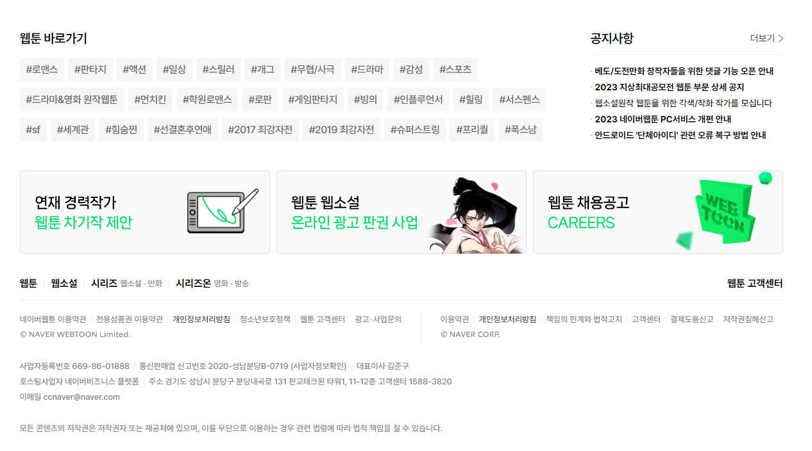

# Woori FISA mini project (html, css)

## 팀원

김민준, 박진영, 윤동열, 윤영인

## 주제

[네이버 웹툰](https://comic.naver.com/webtoon) 클론코딩

* 그동안 학습한 HTML, CSS 태그, 특히 flex 속성을 학습하기 좋은 페이지라고 생각되어 선택한 프로젝트입니다.

## 구성

- 총 네 부분으로 나눠 진행

### Part 1

- 윤영인

### Part 2

- 윤동열

### Part 3

- 김민준

### Part 4

- 박진영

## W3C Validation

## Light house

